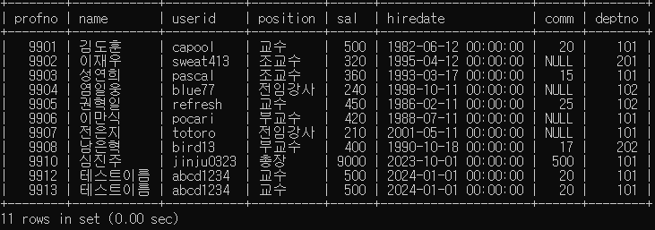
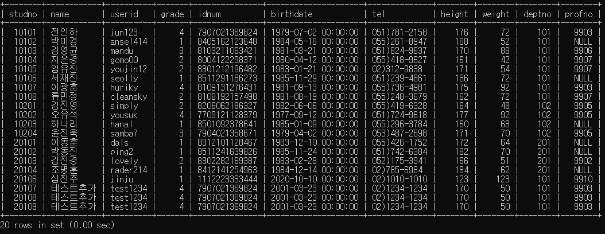
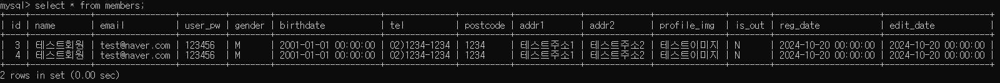

# 심진주 << log >> 과제

> 2024-10-21

# Professor Test log

```
[INFO ] 24-10-21 12:32:08 [DepartmentMapperTest:50] - Starting DepartmentMapperTest using Java 17.0.2 with PID 3500 (started by user in D:\jinju\07_SpringBoot\08-database)
[DEBUG] 24-10-21 12:32:08 [DepartmentMapperTest:51] - Running with Spring Boot v3.3.4, Spring v6.1.13
[INFO ] 24-10-21 12:32:08 [DepartmentMapperTest:654] - No active profile set, falling back to 1 default profile: "default"
[DEBUG] 24-10-21 12:32:08 [LogFactory:109] - Logging initialized using 'class org.apache.ibatis.logging.slf4j.Slf4jImpl' adapter.
[INFO ] 24-10-21 12:32:10 [DepartmentMapperTest:56] - Started DepartmentMapperTest in 2.508 seconds (process running for 3.676)
[DEBUG] 24-10-21 12:32:11 [delete:135] - ==>  Preparing: DELETE FROM department WHERE deptno=?;
[DEBUG] 24-10-21 12:32:11 [delete:135] - ==> Parameters: 203(Integer)
[DEBUG] 24-10-21 12:32:11 [delete:135] - <==    Updates: 0
[DEBUG] 24-10-21 12:32:11 [DepartmentMapperTest:58] - output: 0
[DEBUG] 24-10-21 12:32:11 [insert:135] - ==>  Preparing: INSERT INTO department (dname, loc) VALUES (?, ?);
[DEBUG] 24-10-21 12:32:11 [insert:135] - ==> Parameters: 스프링학과(String), 강의실(String)
[DEBUG] 24-10-21 12:32:11 [insert:135] - <==    Updates: 1
[DEBUG] 24-10-21 12:32:11 [DepartmentMapperTest:32] - output: 1
[DEBUG] 24-10-21 12:32:11 [DepartmentMapperTest:34] - new deptno: 0
[DEBUG] 24-10-21 12:32:11 [update:135] - ==>  Preparing: UPDATE department SET dname=?, loc=? WHERE deptno=?;
[DEBUG] 24-10-21 12:32:11 [update:135] - ==> Parameters: 스프링학과(String), 강의실(String), 0(Integer)
[DEBUG] 24-10-21 12:32:11 [update:135] - <==    Updates: 0
[DEBUG] 24-10-21 12:32:11 [DepartmentMapperTest:48] - output: 0
[DEBUG] 24-10-21 12:32:11 [selectList:135] - ==>  Preparing: SELECT deptno, dname, loc FROM department ORDER BY deptno DESC;
[DEBUG] 24-10-21 12:32:11 [selectList:135] - ==> Parameters:
[DEBUG] 24-10-21 12:32:11 [selectList:135] - <==      Total: 17
[DEBUG] 24-10-21 12:32:11 [DepartmentMapperTest:77] - output: Department(deptNo=328, dname=스프링학과, loc=강의실)
[DEBUG] 24-10-21 12:32:11 [DepartmentMapperTest:77] - output: Department(deptNo=327, dname=스프링학과, loc=강의실)
[DEBUG] 24-10-21 12:32:11 [DepartmentMapperTest:77] - output: Department(deptNo=326, dname=스프링학과, loc=강의실)
[DEBUG] 24-10-21 12:32:11 [DepartmentMapperTest:77] - output: Department(deptNo=325, dname=스프링학과, loc=강의실)
[DEBUG] 24-10-21 12:32:11 [DepartmentMapperTest:77] - output: Department(deptNo=324, dname=스프링학과, loc=강의실)
[DEBUG] 24-10-21 12:32:11 [DepartmentMapperTest:77] - output: Department(deptNo=322, dname=테스트 학과, loc=강남)
[DEBUG] 24-10-21 12:32:11 [DepartmentMapperTest:77] - output: Department(deptNo=321, dname=학과, loc=위치)
[DEBUG] 24-10-21 12:32:11 [DepartmentMapperTest:77] - output: Department(deptNo=320, dname=자바, loc=학원)
[DEBUG] 24-10-21 12:32:11 [DepartmentMapperTest:77] - output: Department(deptNo=319, dname=인터넷정보과, loc=공학관)
[DEBUG] 24-10-21 12:32:11 [DepartmentMapperTest:77] - output: Department(deptNo=317, dname=�ڹ�, loc=�п�)
[DEBUG] 24-10-21 12:32:11 [DepartmentMapperTest:77] - output: Department(deptNo=316, dname=수정학과, loc=수정위치)
[DEBUG] 24-10-21 12:32:11 [DepartmentMapperTest:77] - output: Department(deptNo=315, dname=자바, loc=학원2)
[DEBUG] 24-10-21 12:32:11 [DepartmentMapperTest:77] - output: Department(deptNo=202, dname=hello, loc=world)
[DEBUG] 24-10-21 12:32:11 [DepartmentMapperTest:77] - output: Department(deptNo=201, dname=hello, loc=world)
[DEBUG] 24-10-21 12:32:11 [DepartmentMapperTest:77] - output: Department(deptNo=103, dname=hello, loc=world)
[DEBUG] 24-10-21 12:32:11 [DepartmentMapperTest:77] - output: Department(deptNo=102, dname=멀티미디어학과, loc=2호관)
[DEBUG] 24-10-21 12:32:11 [DepartmentMapperTest:77] - output: Department(deptNo=101, dname=컴퓨터공학과, loc=1호관)
[DEBUG] 24-10-21 12:32:11 [selectItem:135] - ==>  Preparing: SELECT deptno, dname, loc FROM department WHERE deptno=?;
[DEBUG] 24-10-21 12:32:11 [selectItem:135] - ==> Parameters: 102(Integer)
[DEBUG] 24-10-21 12:32:11 [selectItem:135] - <==      Total: 1
[DEBUG] 24-10-21 12:32:11 [DepartmentMapperTest:68] - output: Department(deptNo=102, dname=멀티미디어학과, loc=2호관)
[DEBUG] 24-10-21 12:32:11 [selectList:135] - ==>  Preparing: SELECT profno, name, userid, position, sal, hiredate, comm, deptno FROM professor;
[DEBUG] 24-10-21 12:32:11 [selectList:135] - ==> Parameters:
[DEBUG] 24-10-21 12:32:11 [selectList:135] - <==      Total: 10
[DEBUG] 24-10-21 12:32:11 [ProfessorMapperTest:86] - output: Professor(profNo=9901, name=김도훈, userId=capool, position=교수, sal=500, hireDate=1982-06-12 00:00:00, comm=20, deptNo=101)
[DEBUG] 24-10-21 12:32:11 [ProfessorMapperTest:86] - output: Professor(profNo=9902, name=이재우, userId=sweat413, position=조교수, sal=320, hireDate=1995-04-12 00:00:00, comm=0, deptNo=201)
[DEBUG] 24-10-21 12:32:11 [ProfessorMapperTest:86] - output: Professor(profNo=9903, name=성연희, userId=pascal, position=조교수, sal=360, hireDate=1993-03-17 00:00:00, comm=15, deptNo=101)
[DEBUG] 24-10-21 12:32:11 [ProfessorMapperTest:86] - output: Professor(profNo=9904, name=염일웅, userId=blue77, position=전임강사, sal=240, hireDate=1998-10-11 00:00:00, comm=0, deptNo=102)
[DEBUG] 24-10-21 12:32:11 [ProfessorMapperTest:86] - output: Professor(profNo=9905, name=권혁일, userId=refresh, position=교수, sal=450, hireDate=1986-02-11 00:00:00, comm=25, deptNo=102)
[DEBUG] 24-10-21 12:32:11 [ProfessorMapperTest:86] - output: Professor(profNo=9906, name=이만식, userId=pocari, position=부교수, sal=420, hireDate=1988-07-11 00:00:00, comm=0, deptNo=101)
[DEBUG] 24-10-21 12:32:11 [ProfessorMapperTest:86] - output: Professor(profNo=9907, name=전은지, userId=totoro, position=전임강사, sal=210, hireDate=2001-05-11 00:00:00, comm=0, deptNo=101)
[DEBUG] 24-10-21 12:32:11 [ProfessorMapperTest:86] - output: Professor(profNo=9908, name=남은혁, userId=bird13, position=부교수, sal=400, hireDate=1990-10-18 00:00:00, comm=17, deptNo=202)
[DEBUG] 24-10-21 12:32:11 [ProfessorMapperTest:86] - output: Professor(profNo=9910, name=심진주, userId=jinju0323, position=총장, sal=9000, hireDate=2023-10-01 00:00:00, comm=500, deptNo=101)
[DEBUG] 24-10-21 12:32:11 [ProfessorMapperTest:86] - output: Professor(profNo=9912, name=테스트이름, userId=abcd1234, position=교수, sal=500, hireDate=2024-01-01 00:00:00, comm=20, deptNo=101)
[DEBUG] 24-10-21 12:32:11 [delete:135] - ==>  Preparing: DELETE FROM professor WHERE profno=?;
[DEBUG] 24-10-21 12:32:11 [delete:135] - ==> Parameters: 0(Integer)
[DEBUG] 24-10-21 12:32:11 [delete:135] - <==    Updates: 0
[DEBUG] 24-10-21 12:32:11 [ProfessorMapperTest:67] - output: 0
[DEBUG] 24-10-21 12:32:11 [update:135] - ==>  Preparing: UPDATE professor SET name=?, userid=?, position=?, sal=?, hiredate=?, comm=?, deptno=? WHERE profno=?;
[DEBUG] 24-10-21 12:32:11 [update:135] - ==> Parameters: 테스트이름(String), abcd1234(String), 교수(String), 500(Integer), 20240101(String), 20(Integer), 101(Integer), 0(Integer)
[DEBUG] 24-10-21 12:32:11 [update:135] - <==    Updates: 0
[DEBUG] 24-10-21 12:32:11 [ProfessorMapperTest:57] - output: 0
[DEBUG] 24-10-21 12:32:11 [selectItem:135] - ==>  Preparing: SELECT profno, name, userid, position, sal, hiredate, comm, deptno FROM professor WHERE profno=?;
[DEBUG] 24-10-21 12:32:11 [selectItem:135] - ==> Parameters: 9908(Integer)
[DEBUG] 24-10-21 12:32:11 [selectItem:135] - <==      Total: 1
[DEBUG] 24-10-21 12:32:11 [ProfessorMapperTest:77] - output: Professor(profNo=9908, name=남은혁, userId=bird13, position=부교수, sal=400, hireDate=1990-10-18 00:00:00, comm=17, deptNo=202)
[DEBUG] 24-10-21 12:32:11 [insert:135] - ==>  Preparing: INSERT INTO professor (name, userid, position, sal, hiredate, comm, deptno) VALUES (?, ?, ?, ?, ?, ?, ?);
[DEBUG] 24-10-21 12:32:11 [insert:135] - ==> Parameters: 테스트이름(String), abcd1234(String), 교수(String), 500(Integer), 20240101(String), 20(Integer), 101(Integer)
[DEBUG] 24-10-21 12:32:11 [insert:135] - <==    Updates: 1
[DEBUG] 24-10-21 12:32:11 [ProfessorMapperTest:37] - output: 1
[DEBUG] 24-10-21 12:32:11 [ProfessorMapperTest:39] - new profno: 0
```



<hr/>

# Student Test log

```
[INFO ] 24-10-21 13:04:25 [StudentMapperTest:50] - Starting StudentMapperTest using Java 17.0.2 with PID 12456 (started by user in D:\jinju\07_SpringBoot\08-database)
[DEBUG] 24-10-21 13:04:25 [StudentMapperTest:51] - Running with Spring Boot v3.3.4, Spring v6.1.13
[INFO ] 24-10-21 13:04:25 [StudentMapperTest:654] - No active profile set, falling back to 1 default profile: "default"
[DEBUG] 24-10-21 13:04:26 [LogFactory:109] - Logging initialized using 'class org.apache.ibatis.logging.slf4j.Slf4jImpl' adapter.
[INFO ] 24-10-21 13:04:27 [StudentMapperTest:56] - Started StudentMapperTest in 2.487 seconds (process running for 3.687)
[DEBUG] 24-10-21 13:04:29 [delete:135] - ==>  Preparing: DELETE FROM student WHERE studno=?;
[DEBUG] 24-10-21 13:04:29 [delete:135] - ==> Parameters: 500000(Integer)
[DEBUG] 24-10-21 13:04:29 [delete:135] - <==    Updates: 0
[DEBUG] 24-10-21 13:04:29 [StudentMapperTest:74] - output: 0
[DEBUG] 24-10-21 13:04:29 [selectItem:135] - ==>  Preparing: SELECT studno, name, userid, grade, idnum, birthdate, tel, height, weight, deptno, profno FROM student WHERE studno=?;
[DEBUG] 24-10-21 13:04:29 [selectItem:135] - ==> Parameters: 10101(Integer)
[DEBUG] 24-10-21 13:04:29 [selectItem:135] - <==      Total: 1
[DEBUG] 24-10-21 13:04:29 [StudentMapperTest:84] - output: Student(studNo=10101, name=전인하, userId=jun123, grade=4, idNum=7907021369824, birthDate=1979-07-02 00:00:00, tel=051)781-2158, height=176, weight=72, deptNo=101, profNo=9903)
[DEBUG] 24-10-21 13:04:29 [selectList:135] - ==>  Preparing: SELECT studno, name, userid, grade, idnum, birthdate, tel, height, weight, deptno, profno FROM student;
[DEBUG] 24-10-21 13:04:29 [selectList:135] - ==> Parameters:
[DEBUG] 24-10-21 13:04:29 [selectList:135] - <==      Total: 19
[DEBUG] 24-10-21 13:04:29 [StudentMapperTest:93] - output: Student(studNo=10101, name=전인하, userId=jun123, grade=4, idNum=7907021369824, birthDate=1979-07-02 00:00:00, tel=051)781-2158, height=176, weight=72, deptNo=101, profNo=9903)
[DEBUG] 24-10-21 13:04:29 [StudentMapperTest:93] - output: Student(studNo=10102, name=박미경, userId=ansel414, grade=1, idNum=8405162123648, birthDate=1984-05-16 00:00:00, tel=055)261-8947, height=168, weight=52, deptNo=101, profNo=0)
[DEBUG] 24-10-21 13:04:29 [StudentMapperTest:93] - output: Student(studNo=10103, name=김영균, userId=mandu, grade=3, idNum=8103211063421, birthDate=1981-03-21 00:00:00, tel=051)824-9637, height=170, weight=88, deptNo=101, profNo=9906)
[DEBUG] 24-10-21 13:04:29 [StudentMapperTest:93] - output: Student(studNo=10104, name=지은경, userId=gomo00, grade=2, idNum=8004122298371, birthDate=1980-04-12 00:00:00, tel=055)418-9627, height=161, weight=42, deptNo=101, profNo=9907)
[DEBUG] 24-10-21 13:04:29 [StudentMapperTest:93] - output: Student(studNo=10105, name=임유진, userId=youjin12, grade=2, idNum=8301212196482, birthDate=1983-01-21 00:00:00, tel=02)312-9838, height=171, weight=54, deptNo=101, profNo=9907)
[DEBUG] 24-10-21 13:04:29 [StudentMapperTest:93] - output: Student(studNo=10106, name=서재진, userId=seolly, grade=1, idNum=8511291186273, birthDate=1985-11-29 00:00:00, tel=051)239-4861, height=186, weight=72, deptNo=101, profNo=0)
[DEBUG] 24-10-21 13:04:29 [StudentMapperTest:93] - output: Student(studNo=10107, name=이광훈, userId=huriky, grade=4, idNum=8109131276431, birthDate=1981-09-13 00:00:00, tel=055)736-4981, height=175, weight=92, deptNo=101, profNo=9903)
[DEBUG] 24-10-21 13:04:29 [StudentMapperTest:93] - output: Student(studNo=10108, name=류민정, userId=cleansky, grade=2, idNum=8108192157498, birthDate=1981-08-19 00:00:00, tel=055)248-3679, height=162, weight=72, deptNo=101, profNo=9907)
[DEBUG] 24-10-21 13:04:29 [StudentMapperTest:93] - output: Student(studNo=10201, name=김진영, userId=simply, grade=2, idNum=8206062186327, birthDate=1982-06-06 00:00:00, tel=055)419-6328, height=164, weight=48, deptNo=102, profNo=9905)
[DEBUG] 24-10-21 13:04:29 [StudentMapperTest:93] - output: Student(studNo=10202, name=오유석, userId=yousuk, grade=4, idNum=7709121128379, birthDate=1977-09-12 00:00:00, tel=051)724-9618, height=177, weight=92, deptNo=102, profNo=9905)
[DEBUG] 24-10-21 13:04:29 [StudentMapperTest:93] - output: Student(studNo=10203, name=하나리, userId=hanal, grade=1, idNum=8501092378641, birthDate=1985-01-09 00:00:00, tel=055)296-3784, height=160, weight=68, deptNo=102, profNo=0)
[DEBUG] 24-10-21 13:04:29 [StudentMapperTest:93] - output: Student(studNo=10204, name=윤진욱, userId=samba7, grade=3, idNum=7904021358671, birthDate=1979-04-02 00:00:00, tel=053)487-2698, height=171, weight=70, deptNo=102, profNo=9905)
[DEBUG] 24-10-21 13:04:29 [StudentMapperTest:93] - output: Student(studNo=20101, name=이동훈, userId=dals, grade=1, idNum=8312101128467, birthDate=1983-12-10 00:00:00, tel=055)426-1752, height=172, weight=64, deptNo=201, profNo=0)
[DEBUG] 24-10-21 13:04:29 [StudentMapperTest:93] - output: Student(studNo=20102, name=박동진, userId=ping2, grade=1, idNum=8511241639826, birthDate=1985-11-24 00:00:00, tel=051)742-6384, height=182, weight=70, deptNo=201, profNo=0)
[DEBUG] 24-10-21 13:04:29 [StudentMapperTest:93] - output: Student(studNo=20103, name=김진경, userId=lovely, grade=2, idNum=8302282169387, birthDate=1983-02-28 00:00:00, tel=052)175-3941, height=166, weight=51, deptNo=201, profNo=9902)
[DEBUG] 24-10-21 13:04:29 [StudentMapperTest:93] - output: Student(studNo=20104, name=조명훈, userId=rader214, grade=1, idNum=8412141254963, birthDate=1984-12-14 00:00:00, tel=02)785-6984, height=184, weight=62, deptNo=201, profNo=0)
[DEBUG] 24-10-21 13:04:29 [StudentMapperTest:93] - output: Student(studNo=20106, name=심진주, userId=jinju, grade=1, idNum=1112223333444, birthDate=2020-10-10 00:00:00, tel=02)1010-1010, height=123, weight=123, deptNo=101, profNo=9910)
[DEBUG] 24-10-21 13:04:29 [StudentMapperTest:93] - output: Student(studNo=20107, name=테스트추가, userId=test1234, grade=4, idNum=7907021369824, birthDate=2001-03-23 00:00:00, tel=02)1234-1234, height=170, weight=50, deptNo=101, profNo=9903)
[DEBUG] 24-10-21 13:04:29 [StudentMapperTest:93] - output: Student(studNo=20108, name=테스트추가, userId=test1234, grade=4, idNum=7907021369824, birthDate=2001-03-23 00:00:00, tel=02)1234-1234, height=170, weight=50, deptNo=101, profNo=9903)
[DEBUG] 24-10-21 13:04:29 [insert:135] - ==>  Preparing: INSERT INTO student (name, userid, grade, idnum, birthdate, tel, height, weight, deptno, profno) VALUES (?, ?, ?, ?, ?, ?, ?, ?, ?, ?);
[DEBUG] 24-10-21 13:04:29 [insert:135] - ==> Parameters: 테스트추가(String), test1234(String), 4(Integer), 7907021369824(String), 20010323(String), 02)1234-1234(String), 170(Integer), 50(Integer), 101(Integer), 9903(Integer)
[DEBUG] 24-10-21 13:04:29 [insert:135] - <==    Updates: 1
[DEBUG] 24-10-21 13:04:29 [StudentMapperTest:40] - output: 1
[DEBUG] 24-10-21 13:04:29 [StudentMapperTest:42] - new studno: 0
[DEBUG] 24-10-21 13:04:29 [update:135] - ==>  Preparing: UPDATE student SET name=?, userid=?, grade=?, idnum=?, birthdate=?, tel=?, height=?, weight=?, deptno=?, profno=? WHERE studno=?;
[DEBUG] 24-10-21 13:04:29 [update:135] - ==> Parameters: 테스트수정(String), test5678(String), 2(Integer), 8511241639826(String), 20050525(String), 02)7777-7777(String), 150(Integer), 40(Integer), 201(Integer), 9907(Integer), 0(Integer)
[DEBUG] 24-10-21 13:04:29 [update:135] - <==    Updates: 0
[DEBUG] 24-10-21 13:04:29 [StudentMapperTest:64] - output: 0

```



- 추후에 비밀번호 암호화 : `MD5(#{userPw)`
- 업데이트 할 때 필요없는 부분 직접 지정

# mysite.members Test log

```
[INFO ] 24-10-21 15:01:44 [MembersMapperTest:50] - Starting MembersMapperTest using Java 17.0.2 with PID 12300 (started by user in D:\jinju\07_SpringBoot\08-database)
[DEBUG] 24-10-21 15:01:44 [MembersMapperTest:51] - Running with Spring Boot v3.3.4, Spring v6.1.13
[INFO ] 24-10-21 15:01:44 [MembersMapperTest:654] - No active profile set, falling back to 1 default profile: "default"
[DEBUG] 24-10-21 15:01:45 [LogFactory:109] - Logging initialized using 'class org.apache.ibatis.logging.slf4j.Slf4jImpl' adapter.
[INFO ] 24-10-21 15:01:46 [MembersMapperTest:56] - Started MembersMapperTest in 2.417 seconds (process running for 3.486)
[DEBUG] 24-10-21 15:01:47 [selectList:135] - ==>  Preparing: SELECT id, name, email, user_pw, gender, birthdate, tel, postcode, addr1, addr2, profile_img, is_out, reg_date, edit_date FROM members ORDER BY id DESC;
[DEBUG] 24-10-21 15:01:47 [selectList:135] - ==> Parameters:
[DEBUG] 24-10-21 15:01:47 [selectList:135] - <==      Total: 2
[DEBUG] 24-10-21 15:01:47 [MembersMapperTest:99] - output: Members(id=3, name=테스트회원, email=test@naver.com, userPw=123456, gender=M, birthDate=2001-01-01 00:00:00, tel=02)1234-1234, postcode=1234, addr1=테스트주소1, addr2=테스트주소2, profileImg=테스트이미지, isOut=N, regDate=2024-10-20 00:00:00, editDate=2024-10-20 00:00:00)
[DEBUG] 24-10-21 15:01:47 [MembersMapperTest:99] - output: Members(id=2, name=테스트회원, email=test@naver.com, userPw=123456, gender=M, birthDate=2001-01-01 00:00:00, tel=02)1234-1234, postcode=1234, addr1=테스트주소1, addr2=테스트주소2, profileImg=테스트이미지, isOut=N, regDate=2024-10-20 00:00:00, editDate=2024-10-20 00:00:00)
[DEBUG] 24-10-21 15:01:47 [update:135] - ==>  Preparing: UPDATE members SET name=?, email=?, user_pw=?, gender=?, birthdate=?, tel=?, postcode=?, addr1=?, addr2=?, profile_img=?, is_out=?, reg_date=?, edit_date=? WHERE id=?;
[DEBUG] 24-10-21 15:01:47 [update:135] - ==> Parameters: 테스트123(String), test123@naver.com(String), 78910(String), M(String), 20030303(String), 02)5555-1234(String), 1234(String), 테스트주소1-1(String), 테스트주소2-2(String), 테스트이미지2(String), N(String), 20241020(String), 20241020(String), 0(Integer)
[DEBUG] 24-10-21 15:01:47 [update:135] - <==    Updates: 0
[DEBUG] 24-10-21 15:01:47 [MembersMapperTest:70] - output: 0
[DEBUG] 24-10-21 15:01:47 [insert:135] - ==>  Preparing: INSERT INTO members (name, email, user_pw, gender, birthdate, tel, postcode, addr1, addr2, profile_img, is_out, reg_date, edit_date) VALUES (?, ?, ?, ?, ?, ?, ?, ?, ?, ?, ?, ?, ?);
[DEBUG] 24-10-21 15:01:47 [insert:135] - ==> Parameters: 테스트회원(String), test@naver.com(String), 123456(String), M(String), 20010101(String), 02)1234-1234(String), 1234(String), 테스트주소1(String), 테스트주소2(String), 테스트이미지(String), N(String), 20241020(String), 20241020(String)
[DEBUG] 24-10-21 15:01:47 [insert:135] - <==    Updates: 1
[DEBUG] 24-10-21 15:01:47 [MembersMapperTest:43] - output: 1
[DEBUG] 24-10-21 15:01:47 [MembersMapperTest:45] - new id: 0
[DEBUG] 24-10-21 15:01:47 [delete:135] - ==>  Preparing: DELETE FROM members WHERE id=?;
[DEBUG] 24-10-21 15:01:47 [delete:135] - ==> Parameters: 2(Integer)
[DEBUG] 24-10-21 15:01:47 [delete:135] - <==    Updates: 1
[DEBUG] 24-10-21 15:01:47 [MembersMapperTest:80] - output: 1
[DEBUG] 24-10-21 15:01:47 [selectItem:135] - ==>  Preparing: SELECT id, name, email, user_pw, gender, birthdate, tel, postcode, addr1, addr2, profile_img, is_out, reg_date, edit_date FROM members WHERE id=?;
[DEBUG] 24-10-21 15:01:47 [selectItem:135] - ==> Parameters: 3(Integer)
[DEBUG] 24-10-21 15:01:47 [selectItem:135] - <==      Total: 1
[DEBUG] 24-10-21 15:01:47 [MembersMapperTest:90] - output: Members(id=3, name=테스트회원, email=test@naver.com, userPw=123456, gender=M, birthDate=2001-01-01 00:00:00, tel=02)1234-1234, postcode=1234, addr1=테스트주소1, addr2=테스트주소2, profileImg=테스트이미지, isOut=N, regDate=2024-10-20 00:00:00, editDate=2024-10-20 00:00:00)
```


